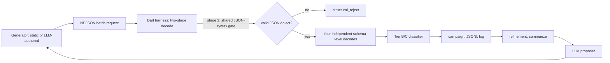

# Beyond Sanitizers: LLM-Guided Refinement for Differential JSON Deserialization Testing in Dart

Second-paper follow-up to [agentic-grammar-fuzzing](https://github.com/ziyadmansy/agentic-grammar-fuzzing):
that project evaluated an LLM-guided, coverage-free grammar-fuzzing pipeline
against two independent C JSON parsers under a sanitizer-based crash oracle,
and named a memory-safe target — where "crash" has no sanitizer-based
meaning — as unaddressed future work along a materially different
generalization axis. This repository takes up exactly that axis: the
identical refinement loop, retargeted at four widely-used Dart/Flutter JSON
deserialization paths, with the sanitizer-based crash oracle replaced by two
oracles that need no crash at all — cross-implementation differential
divergence, and a ground-truth numeric round-trip check.

**Paper:** the full write-up lives under [`paper/`](paper/main.tex) (LaTeX
source, IEEEtran conference format; build with `tectonic main.tex` or any
standard LaTeX toolchain) and is archived as a preprint at
[doi.org/10.5281/zenodo.22555795](https://doi.org/10.5281/zenodo.22555795) —
see [Results](#results) below for the headline numbers, or the paper itself
for full methodology, related work, and discussion.

## Contents

- [Overview](#overview)
- [Oracles](#oracles)
- [Target set and shared schema](#target-set-and-shared-schema)
- [Pipeline](#pipeline)
- [Repository layout](#repository-layout)
- [Setup](#setup)
- [Harness](#harness)
- [Baseline and refinement campaigns](#baseline-and-refinement-campaigns)
- [Results](#results)
- [What transfers unmodified from the original pipeline](#what-transfers-unmodified-from-the-original-pipeline)
- [Environment notes](#environment-notes)
- [Citation](#citation)

## Overview

A first attempt at porting the original pipeline's crash oracle onto a
single, well-audited Dart JSON decoder would likely reproduce the same kind
of negative result the original project already reported for its second C
target — explainable, but not informative, since a heavily-used
standard-library decoder is exactly the kind of target unlikely to crash
under a bounded fuzzing budget. This project rejects that port and designs
two oracles instead that do not depend on a crash occurring at all:

- **Cross-implementation differential divergence** — every generated
  document is run through four independently-implemented Dart JSON
  deserialization paths simultaneously, and disagreement between them (one
  accepting where another rejects, or two accepting but decoding to
  different values), not a crash, is the signal.
- **Ground-truth numeric round-trip** — JSON permits arbitrary-precision
  integer literals syntactically; this oracle checks whether a decoded
  value preserves the exact input magnitude, which needs no assumption
  about what "correct" looks like beyond the literal text the generator
  wrote.

The central finding: the same refinement mechanism that raises acceptance
rate against a single decoder (replicating the original paper's result
almost exactly on this new runtime) does **not** transfer to the
differential-divergence objective — it underperforms a simple static
generator by an order of magnitude, and two tested follow-ups (relaxing the
sandbox's `import json` restriction; feeding back perturbation categories
instead of a bare score) both fail to close the gap, one of them making
things measurably worse. Whether LLM-guided refinement helps depends on the
objective it is asked to optimize, holding target, model, and iteration
budget fixed.

## Oracles

| | |
|---|---|
| Format | JSON |
| Target language/runtime | Dart 3.13.2 |
| Crash oracle (original pipeline) | N/A — memory-safe target, no sanitizer signal |
| Oracle 1 | Cross-path differential divergence (accept/reject, or value) |
| Oracle 2 | Ground-truth exact-integer round-trip on a bare JSON number field |

Full oracle taxonomy (structural gate, per-path exception classification,
canonical-value comparison) is in [`docs/dart-oracle-design.md`](docs/dart-oracle-design.md).

## Target set and shared schema

Four Dart JSON deserialization paths over one shared record schema, chosen
for being how a real Flutter codebase actually deserializes JSON today, not
for novelty:

| Path | Package | Pinned version |
|---|---|---|
| A — Manual | `dart:convert` (SDK) | Dart SDK 3.13.2 |
| B — `json_serializable` | `json_serializable` + `json_annotation` | 6.14.1 |
| C — `freezed` | `freezed` + `freezed_annotation` | 4.0.1 |
| D — `built_value` | `built_value` + `built_value_generator` | 8.13.0 |

Exact versions are pinned in [`harness/pubspec.lock`](harness/pubspec.lock).
A second, smaller schema — a discriminated union, `Payload.text(String) |
Payload.number(num)` — is used in a separate, additive side study
(Section IV-F of the paper) specifically to exercise `freezed`'s own native
union-dispatch feature, which the main schema never does (freezed delegates
every main-schema field to json_serializable's generated code).

## Pipeline



1. **Generators** — `src/agentic_fuzzing/json_strategy.py` (RQ1, reused
   unmodified from the original pipeline, targets the shared structural
   gate directly) and `src/agentic_fuzzing/dart_record_strategy.py` (RQ2/RQ3,
   schema-aware, perturbation-based).
2. **Harness** (`harness/bin/dart_json_harness.dart`) — one AOT-compiled,
   long-lived process per campaign, reading base64-encoded candidates over
   stdin and writing one classified JSON result per line.
3. **Runner** (`src/agentic_fuzzing/dart_runner.py`) — batch subprocess
   client wrapping the harness with a whole-campaign timeout.
4. **Campaign** (`src/agentic_fuzzing/dart_campaign.py` for RQ1,
   `dart_divergence_campaign.py` for RQ2) — drives inputs through the
   runner and persists one JSON record per input.
5. **Refinement loop** (`src/agentic_fuzzing/refinement.py`, reused
   unmodified for RQ1; `dart_divergence_campaign.py`'s own loop for RQ2) —
   summarizes each campaign, builds a prompt, sends it to an LLM proposer,
   validates and sandboxes the returned strategy
   (`src/agentic_fuzzing/proposal.py`, reused unmodified), and runs the
   next campaign with it.

## Repository layout

```text
grammar/JSON.g4          ANTLR JSON grammar, vendored (RQ1's generator target)
harness/                 Dart package: the four-path harness, oracle, and schema
  lib/schema/            Record schema (paths A-D) and the union side-study schema
  bin/                   Harness executable, smoke tests, exception characterization
scripts/                 Python CLI entry points: baseline/refinement runners, aggregation, analysis
src/agentic_fuzzing/     Python pipeline package (generators, runner, campaign, refinement, sandboxing)
docs/                    Full design doc and the original project's technical handoff
paper/                   LaTeX paper source
artifacts/repeated/      Every seeded campaign's raw results underlying the paper's tables
```

## Setup

```sh
# Python side
python3 -m venv .venv
source .venv/bin/activate
pip install -r requirements.txt
```

Hypothesis is pinned to `6.165.5` because the deterministic-seeding shim
(`src/agentic_fuzzing/seeding.py`, reused unmodified from the original
project) is coupled to a private Hypothesis internal — verified against
this exact version; a newer version already lacks the attribute.

```sh
# Dart side
cd harness && dart pub get
```

Requires Dart SDK `3.13.2`+ (freezed `4.0.1` requires SDK `>=3.13.0`).

## Harness

```sh
./scripts/build_dart_target.sh   # compiles build/dart_json_harness, runs a sanity check
```

```sh
printf '{"input_b64":"%s"}\n' "$(printf '{"id":1,"amount":"1","name":null,"status":"active","tags":[],"child":null}' | base64)" \
    | ./build/dart_json_harness
```

## Baseline and refinement campaigns

```sh
# RQ1: grammar-only baseline (no LLM) vs. LLM-refined, n=5 seeded runs
PYTHONPATH=src .venv/bin/python scripts/run_dart_rq1_baseline.py \
    --artifact-dir artifacts/repeated/rq1-baseline-n5 --runs 5 --examples 500 --seed 0
export OPENAI_API_KEY=sk-...
PYTHONPATH=src .venv/bin/python scripts/run_dart_rq1_refinement.py \
    --artifact-dir artifacts/repeated/rq1-loop-n5 --runs 5 --iterations 5 --examples 500 --seed 0
.venv/bin/python scripts/aggregate_runs.py artifacts/repeated/rq1-baseline-n5
.venv/bin/python scripts/aggregate_runs.py artifacts/repeated/rq1-loop-n5

# RQ2: schema-aware divergence-hunting baseline vs. LLM-refined
PYTHONPATH=src .venv/bin/python scripts/run_dart_rq2_baseline.py \
    --artifact-dir artifacts/repeated/rq2-baseline-n5 --runs 5 --examples 500 --seed 0
PYTHONPATH=src .venv/bin/python scripts/run_dart_rq2_refinement.py \
    --artifact-dir artifacts/repeated/rq2-loop-n5 --runs 5 --iterations 5 --examples 500 --seed 0
.venv/bin/python scripts/aggregate_rq2_runs.py artifacts/repeated/rq2-baseline-n5
.venv/bin/python scripts/aggregate_rq2_runs.py artifacts/repeated/rq2-loop-n5

# RQ3: numeric round-trip, computed as an analysis pass over already-collected RQ2 data
.venv/bin/python scripts/analyze_rq3_precision.py artifacts/repeated/rq2-baseline-n5 artifacts/repeated/rq2-loop-n5
```

`--allow-json` and `--category-feedback` on `run_dart_rq2_refinement.py`
select the two follow-up ablations reported in the paper (Sections IV-C and
IV-D).

## Results

| RQ | Baseline mean | Refined mean | Test |
|---|---:|---:|---|
| RQ1 — acceptance rate | 50.0% | 92.0% | Complete separation, exact $p \approx 0.0079$ |
| RQ2 — divergence rate | 22.2% | 2.93% | Complete separation, exact $p \approx 0.0079$ (opposite direction) |
| RQ2 ablation — `import json` allowed | — | 2.20% | $p \approx 0.69$ vs. constrained sandbox (no improvement) |
| RQ2 follow-up — category feedback | — | 0.95% | $p \approx 0.032$ vs. score-only prompt (significantly worse) |

RQ3: `json_serializable`/`freezed` silently saturate an out-of-range
integer field to `int64::MIN`/`MAX` at a 5.7% rate across 43,336 checks
(manual/`built_value`: 0.0%). Two concrete, practitioner-actionable defects
and the discriminated-union side study are detailed in the paper.

All numbers trace to raw campaign data under `artifacts/repeated/`.

## What transfers unmodified from the original pipeline

`src/agentic_fuzzing/seeding.py`, `proposal.py`, `experiment.py`, `llm.py`,
`json_strategy.py`, and `refinement.py` (bar one import line) are the
original project's files, copied verbatim — none of them are C- or
format-specific. `scripts/aggregate_runs.py` is likewise copied verbatim:
RQ1's summary shape is byte-identical to the original's. Everything else
(the four-path harness, the two-stage oracle, the schema-aware generator,
the divergence campaign/summary/refinement-loop module) is new, since the
original's per-input-subprocess, sanitizer-based model does not apply to a
memory-safe, multi-implementation target.

## Environment notes

- `freezed 4.0.1` requires Dart SDK `>=3.13.0`; this was a global toolchain
  upgrade on the development machine (`flutter upgrade`), done deliberately
  since it affects every Dart/Flutter project on that machine, not just
  this one.
- The batch harness's NDJSON responses must be split on the literal `\n`
  byte, not with general-purpose text line-splitting (e.g. Python's
  `str.splitlines()`), which also breaks on Unicode line separators that
  are legal, unescaped characters inside a JSON string — see
  `src/agentic_fuzzing/dart_runner.py`.

## Citation

[](https://doi.org/10.5281/zenodo.22555795)
[](https://doi.org/10.5281/zenodo.22544011)

If you use this work, please cite the paper (preferred — see also
[`CITATION.cff`](CITATION.cff)):

```bibtex
@article{ibrahim2026beyond,
  author = {Ibrahim, Ziyad Mohammad Mansy},
  title  = {{Beyond Sanitizers: LLM-Guided Refinement for Differential JSON Deserialization Testing in Dart}},
  year   = {2026},
  doi    = {10.5281/zenodo.22555795}
}
```

To cite the software/data artifact itself rather than the paper, use the
concept DOI above (it always resolves to the latest archived version; cite a
specific version's own DOI instead if you need to pin to exactly the
artifact you used):

```bibtex
@software{ibrahim2026beyonddata,
  author  = {Ibrahim, Ziyad Mohammad Mansy},
  title   = {{Beyond Sanitizers: LLM-Guided Refinement for Differential JSON Deserialization Testing in Dart}},
  year    = {2026},
  version = {1.0.0},
  doi     = {10.5281/zenodo.22544011},
  url     = {https://github.com/ziyadmansy/agentic-fuzzing-dart-json}
}
```

---

**Author:** Ziyad Mohammad Mansy Ibrahim — ziyadmohammad37@gmail.com — [ORCID](https://orcid.org/0009-0008-3499-3828)
